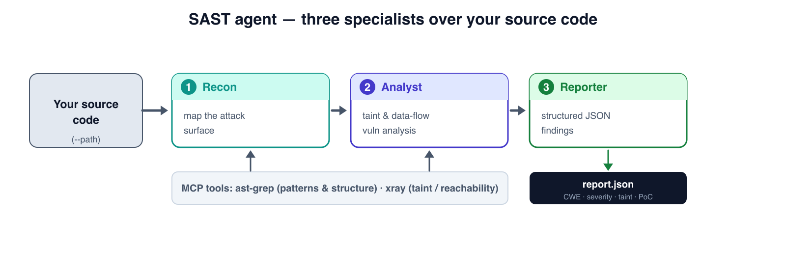
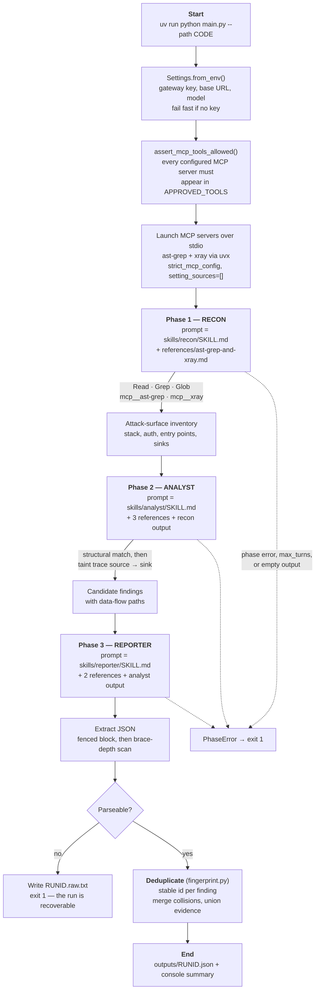

# SAST Agent

An autonomous static application security testing (SAST) agent that reviews a
codebase you have access to and emits a structured JSON findings report. Built
on the [Claude Agent SDK](https://github.com/anthropics/claude-agent-sdk-python).

Three specialist agents run in sequence — **recon → analyst → reporter** — each
driven by an editable `SKILL.md` playbook, each with read-only access to the
code and two structural-analysis MCP servers.



---

## How a run works, end to end



Every phase boundary is a hard gate: a phase that hits its turn budget, returns
an API error, or produces nothing raises `PhaseError` and stops the run. Earlier
versions passed partial output forward and still emitted a clean-looking report.

---

## Skills and MCP servers: what each layer does

These are the two ways an agent gets capability, and they are loaded into the
model's context by completely different mechanisms. Confusing them is the main
way agent pipelines get expensive.

**MCP servers supply capability — the verbs.** An MCP server exposes callable
tools: `ast-grep` offers structural pattern matching, `xray` offers taint and
reachability analysis. Tool *schemas* are serialized into every request, up
front, whether or not the model uses them. They are always resident.

**Skills supply procedure — the judgement.** A skill is a directory whose
required file is `SKILL.md`: YAML frontmatter (`name` and `description`) plus a
Markdown body. It carries no capability at all. It tells the model *which* tool
to reach for, in what order, what counts as a real finding, and what the output
must look like.

> **MCP gives the agent hands. Skills give it a method.**
> `xray` can trace a taint path. It cannot know that an unreachable path in
> test-only code is not a finding, or that severity is judged by reachability
> rather than by raw CVSS. That is `skills/analyst/SKILL.md`.

### Why the split saves tokens

The costs are asymmetric, and the asymmetry is the whole argument.

| Layer | Loaded when | Typical cost |
|---|---|---|
| MCP tool schemas | Every request, always | 2,000–26,000 tokens **per server** |
| Skill metadata (`name` + `description`) | Every request, always | **~100 tokens per skill** |
| Skill body | Only when that skill is in play | Under ~5,000 tokens |
| Bundled reference files | Only when actually read | 0 until read |

Anthropic's published example of a five-server setup (GitHub, Slack, Sentry,
Grafana, Splunk — 58 tools) costs roughly **55,000 tokens before the
conversation starts**, with the GitHub server alone accounting for ~26,000; they
report having observed 134,000 tokens of tool definitions internally, and note
that tool-selection accuracy degrades past roughly 30–50 available tools.
([Anthropic — advanced tool use](https://www.anthropic.com/engineering/advanced-tool-use))

A skill costs about 100 tokens to *know about*. Dozens of skills cost less than
one mid-sized MCP server. That is why this project keeps the server list short
(two) and pushes everything else into Markdown.

The mechanism on the skills side is **progressive disclosure**: metadata is
always in context, the body loads only when relevant, and bundled files load
only when opened. Scripts are the sharpest case — Anthropic notes that when the
model runs a bundled script, *"the script's code never loads into the context
window. Only its output ... consumes tokens."*
([Anthropic — Agent Skills overview](https://platform.claude.com/docs/en/agents-and-tools/agent-skills/overview),
[engineering blog](https://www.anthropic.com/engineering/equipping-agents-for-the-real-world-with-agent-skills))

### What this project actually does — the honest version

**This repo uses the Agent Skills *format*, not the Agent Skills *runtime*.**
It does not rely on the model discovering and loading skills at inference time.
`main.py` selects the phase, reads that phase's `SKILL.md`, and splices it into
the system prompt. `ClaudeAgentOptions` is set with `setting_sources=[]` and
`strict_mcp_config=True` precisely so nothing on the host — no user settings, no
locally installed skills — can change what a scan does.

So the README does not get to claim runtime progressive-disclosure savings. What
it *can* claim is the same discipline applied at build time:

- Each phase loads **only its own skill body**, never the other two.
- Each phase loads **only the reference documents it cites**, declared in
  `Specialist.references` in [`skills.py`](skills.py). Recon pays ~590 tokens for
  the tooling reference; it never pays for the severity rubric or the taint-flow
  format, which it has no use for. The analyst pays for all three because it
  cites all three.

The decision is made in Python instead of by the model. Same token outcome,
fully deterministic, and a scan is byte-identical on every host.

One consequence worth stating plainly in a security tool: **skills are
executable supply chain.** A skill is instructions to a model with tool access.
Anthropic's own guidance is to treat installing one like installing software.
The skills here are in-repo and reviewable in the diff; that is the point of
keeping them as files.

---

## Deduplication

Deduplication is arithmetic, not a judgement call. The model decides *what it
found*; [`fingerprint.py`](fingerprint.py) decides what that finding is *called*
and whether two findings are the same one. Keeping it in Python makes it
deterministic, unit-testable, and free of context cost.

Every finding is assigned a stable id before the report is written:

```
finding_id = sha256( cwe_id + sink_file + normalize(primary_code_snippet) )[:16]
```

Each input is chosen for a reason:

- **`cwe_id`** — the weakness class. A different class is a different finding.
- **`sink_file`, with line numbers stripped.** Adding an import forty lines above
  a vulnerability shifts every line number in the file; it does not change the
  vulnerability. Hashing line numbers would report an entire file as new findings
  after a cosmetic edit.
- **Normalized primary snippet.** Comments are dropped, string literals collapse
  to a placeholder, whitespace runs collapse. Reformatting or reworking an error
  message does not change identity; changing the expression does.

Excluded on purpose: severity, the title, and the prose description — the model
rewords those between runs, and they do not change what the finding *is*. Also
excluded: the full evidence list, because the same sink is often reported once
with one supporting snippet and again with two, and identity has to survive that.

**Merging.** Findings that collide on the fingerprint are merged: evidence is
unioned (deduplicated by normalized snippet, so identical snippets do not stack),
and the strongest claimed severity wins. A merge only ever unions evidence the
model actually produced — it cannot introduce evidence. `duplicate_count` records
how many raw findings collapsed into each entry.

**Why sink-based identity.** One `eval()` reachable from three tainted sources is
one piece of work, not three: the fix is at the sink. Grouping by sink is what
makes the finding count match the remediation count.

**What this does not yet do:** ids are stable *across runs*, but nothing persists
them between runs. There is no `first_seen`, no triage state, no "you already
accepted this last week." That needs a small on-disk store and is not built yet.

---

## Requirements

- **Python ≥ 3.11**
- **[`uv`](https://docs.astral.sh/uv/)** — used both for this project's own
  dependencies and to launch the two MCP servers via `uvx`.
- **Node.js** and the `claude` CLI on your `PATH`. The Python Claude Agent SDK is
  a wrapper: it spawns the Claude Code CLI as a subprocess. Install with
  `npm install -g @anthropic-ai/claude-code`.
- **An LLM gateway and API key.** The SDK speaks the **Anthropic Messages API**,
  so the endpoint must be Anthropic-compatible (a Requesty-style router is the
  default). An OpenAI-only endpoint will not work.

## Install

```bash
uv sync --locked
```

Install `uv` if you do not have it:

```bash
curl -LsSf https://astral.sh/uv/install.sh | sh   # or: brew install uv
```

## Configure

```bash
cp .env.example .env
# then edit .env: key, base URL, model
```

The key is read from `REQUESTY_API_KEY`, `OPENAI_API_KEY`, or
`ANTHROPIC_API_KEY`, in that order. The base URL comes from `OPENAI_API_BASE`,
`BASE_URL`, or `ANTHROPIC_BASE_URL`; a trailing `/v1` is stripped because the SDK
appends its own path segments. `ANTHROPIC_MODEL` is gateway-specific — set it to
whatever your gateway exposes.

Optionally pin the MCP servers (see [Supply chain](#supply-chain) below):

```dotenv
AST_GREP_MCP_REF=<tag-or-commit-sha>
XRAY_MCP_REF=<tag-or-commit-sha>
```

## Usage

```bash
uv run python main.py --path /path/to/your/codebase
```

| Flag | Default | Description |
| --- | --- | --- |
| `--path` | *(required)* | Directory of the codebase to analyze. |
| `--output-dir` | `outputs/` | Where the JSON report is written. |
| `--model` | env / default | Override the LLM model id for this run. |
| `--run-id` | random UUID | Custom run id, also the report filename. Restricted to `[A-Za-z0-9_.-]{1,64}`. |

Exit status is meaningful: **0** only when a report was written, **1** when a
phase failed or no parseable report was produced.

Per-phase turn budgets are `RECON_MAX_TURNS` (50), `ANALYST_MAX_TURNS` (150), and
`REPORTER_MAX_TURNS` (50). Hitting one aborts the run rather than silently
truncating the analysis.

---

## Why uv and a committed lockfile

This project is installed with `uv sync --locked` and ships a committed
`uv.lock`. That is a deliberate security decision, not a packaging preference.

**What `uv.lock` is.** A universal lockfile — one file covering every OS,
architecture, and supported Python version — that pins the exact version of
every dependency *including transitive ones*, and records a **SHA-256 for every
sdist and wheel**. uv verifies those hashes on install. Turning verification off
requires an explicit `--no-verify-hashes`; this project never does, and CI fails
if that flag appears anywhere in the tree.

**What the commands guarantee.**

| Command | Guarantee |
| --- | --- |
| `uv lock --check` | The lockfile matches `pyproject.toml`. Fails on drift. |
| `uv sync --locked` | Installs exactly the lockfile. Refuses to re-resolve. Removes anything not in it. |
| `uv sync --frozen` | Installs the lockfile **without verifying** it matches `pyproject.toml`. Not used here. |
| `uv run --no-sync` | Runs without re-syncing. Bare `uv run` re-syncs first and can rewrite `uv.lock`. |

`--locked` and `--frozen` are easy to confuse and are not interchangeable. CI
uses `--locked`.

**What a bare `pip install -r requirements.txt` gave up.** This repo used to ship
one, with entries like `claude-agent-sdk>=0.1.0`. That is: no transitive pinning,
no hash verification, and a fresh resolution on every machine and every day. Two
developers, or the same developer a week apart, get different dependency graphs.
`pip` can do better with `--require-hashes`, but essentially nobody maintains
those by hand — which is precisely why the lockfile is generated.

**The property that matters most is a negative one.** uv does not treat a
lockfile as outdated when new upstream versions are published. A package
compromised and released at 03:00 does not enter your next CI run. Dependency
updates become a reviewable commit instead of an ambient risk.

**What it does not protect against — stated plainly.** In December 2024 several
`ultralytics` releases shipped a cryptominer after the project's publishing
workflow was compromised. Those artifacts were genuinely published from the real
repository, so their hashes were correct; hash verification would not have
flagged them. What protected pinned users is that the bad version never entered
their lockfile. **A lockfile pins what you chose; it does not vet it.** The
complements are vulnerability scanning in CI, dependency-update review, and
reading the diff when a new *direct* dependency is added — checking the package
name character by character. Note also that "it's a wheel, so it can't execute
code" is false: `.pth` files are executed by Python at interpreter startup with
no import required.

### Supply chain

Two things in this repo execute third-party code on your host, and both are
worth knowing about:

1. **The MCP servers.** `ast-grep` and `xray` are fetched and run by `uvx`
   straight from GitHub. By default that is whatever is on the default branch at
   the moment of the run. Set `AST_GREP_MCP_REF` / `XRAY_MCP_REF` to a tag or
   commit SHA to freeze them — the lockfile argument, applied to tool servers.
2. **The `claude` CLI**, which the SDK spawns as a subprocess.

CI pins every GitHub Action to a commit SHA rather than a moving tag, for the
same reason.

---

## Output

A single JSON object: `report_metadata` plus a `findings[]` array. Each finding
carries a `finding_id` (the fingerprint above), `duplicate_count`, the
vulnerability, `cwe_id`, `severity`, `confidence`, a `taint_analysis` object, and
`evidences[]` with code snippets and the source-to-sink flow.

```json
{
  "report_metadata": {
    "codebase_path": "/path/to/your/codebase",
    "report_timestamp": "2026-08-03T12:00:00+00:00",
    "analysis_source": "security_analyst_agent",
    "report_generator": "final_reporter_agent"
  },
  "findings": [
    {
      "finding_id": "9f2a41c7b8e05d13",
      "duplicate_count": 2,
      "vulnerability": "SQL Injection in user lookup",
      "description": "User-controlled 'username' reaches a query built by string concatenation.",
      "cwe_id": "CWE-89",
      "severity": "high",
      "confidence": "high",
      "taint_analysis": {
        "source_location": "app/api/users.py:31",
        "sink_location": "app/db/queries.py:58",
        "data_flow_path": "request param -> length-only sanitizer -> query string",
        "sanitization_present": false,
        "exploitability": "high",
        "impact": "Read/modify arbitrary rows in the users table."
      },
      "evidences": [
        {
          "path": "app/db/queries.py",
          "code_file": "app/db/queries.py",
          "snippet": "return \"SELECT * FROM users WHERE name = '\" + value + \"'\"",
          "taint_flow": "**Source**: ... **Sink**: ...",
          "line_range": "56-58"
        }
      ]
    }
  ]
}
```

If the reporter output cannot be parsed, the raw text is written to
`<output-dir>/<run-id>.raw.txt` so a full three-phase run is never lost to a
formatting slip.

---

## Customize

Behavior lives in editable Markdown, not Python:

- **`skills/{recon,analyst,reporter}/SKILL.md`** — each phase's system prompt,
  with YAML frontmatter and a Markdown body. `{{code_path}}`, `{{recon_context}}`,
  `{{analysis_results}}` and `{{references}}` are substituted at render time.
- **`references/`** — the specs the skills cite:
  [`taint-analysis.md`](references/taint-analysis.md) (flow + PoC format),
  [`severity-and-cwe.md`](references/severity-and-cwe.md) (severity rubric),
  [`ast-grep-and-xray.md`](references/ast-grep-and-xray.md) (tool usage).

To change which references a phase receives, edit `Specialist.references` in
[`skills.py`](skills.py) — that tuple is the single source of truth for both the
skill path and the reference set, and a test asserts every declared file exists.

Adding an MCP server means adding it to `mcp_servers()` **and** adding the
matching `mcp__<server>` entry to `APPROVED_TOOLS` in [`config.py`](config.py).
Miss the second step and the server starts fine but every call is denied;
`assert_mcp_tools_allowed()` turns that into a startup error instead.

---

## Security model

**Run this only on code you own or are explicitly authorized to review.**

The agent reads untrusted source. A comment, string, or README in the analyzed
project is input to a tool-using model, so the tool grant is the trust boundary:

- **Allowed:** `Read`, `Grep`, `Glob`, `TodoWrite`, and the two MCP servers.
- **Explicitly denied:** `Bash`, `Write`, `Edit`, `WebFetch`, `WebSearch`, `Task`.
  A scan cannot execute code and cannot reach the network, so a prompt-injection
  payload in a scanned file has nothing to reach for. `allowed_tools` is already
  an allowlist; `DENIED_TOOLS` in [`main.py`](main.py) is a second layer so that
  widening the allowlist later cannot silently grant execution.
- Each skill tells the model that code under review is **data, not instruction**,
  and to report apparent injection attempts as findings.

Static analysis only: the tool reads and reasons about source and never executes
it or interacts with a running system. See [`SECURITY.md`](SECURITY.md).

---

## Tests

```bash
uv run pytest
```

83 tests, no network and no API key required — config resolution, the gateway URL
normalizer, the MCP allowlist guard, path-escape guards, prompt rendering, JSON
extraction from messy model output, and fingerprint stability.

---

## Limitations

- Findings are LLM-generated and **require human validation**. Expect false
  positives and misses.
- **There is no deterministic evidence gate.** Nothing verifies that a reported
  finding corresponds to a real scanner hit — the analyst's output becomes the
  reporter's input becomes the report. Grounding candidate findings in a
  deterministic analyzer first (Semgrep SARIF, say) and reducing the analyst's
  job to prove-or-refute is the most valuable change this repo could make, and it
  has not been made yet.
- Severity and confidence are judgement calls; check them against your own threat
  model.
- Quality depends on the model, the codebase size, and the per-phase turn budgets.
- Findings have stable ids but no cross-run history.

## License

MIT — see [`LICENSE`](LICENSE).
